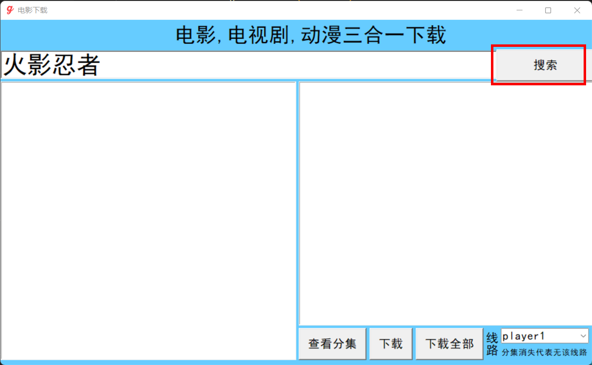
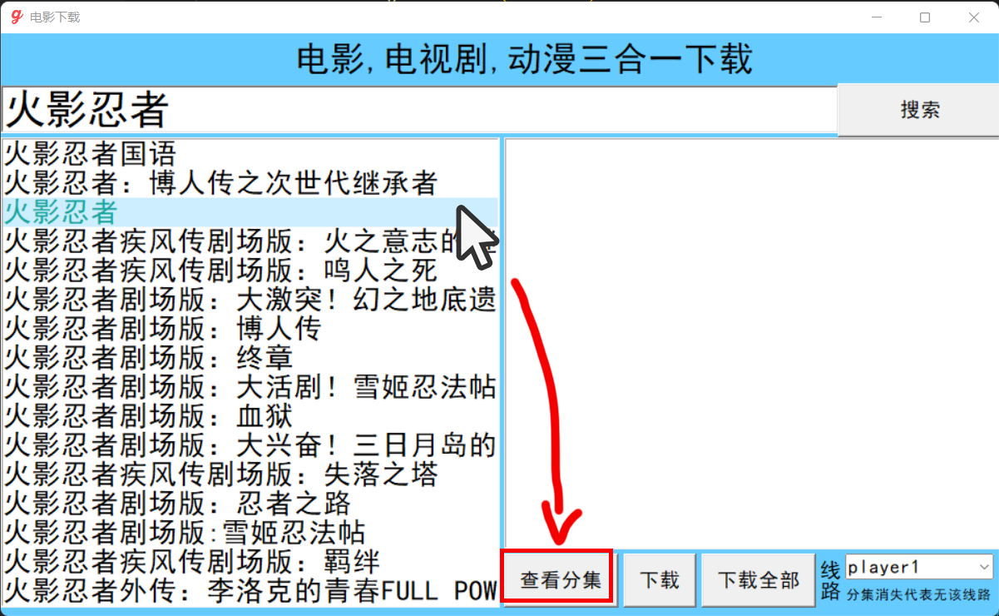
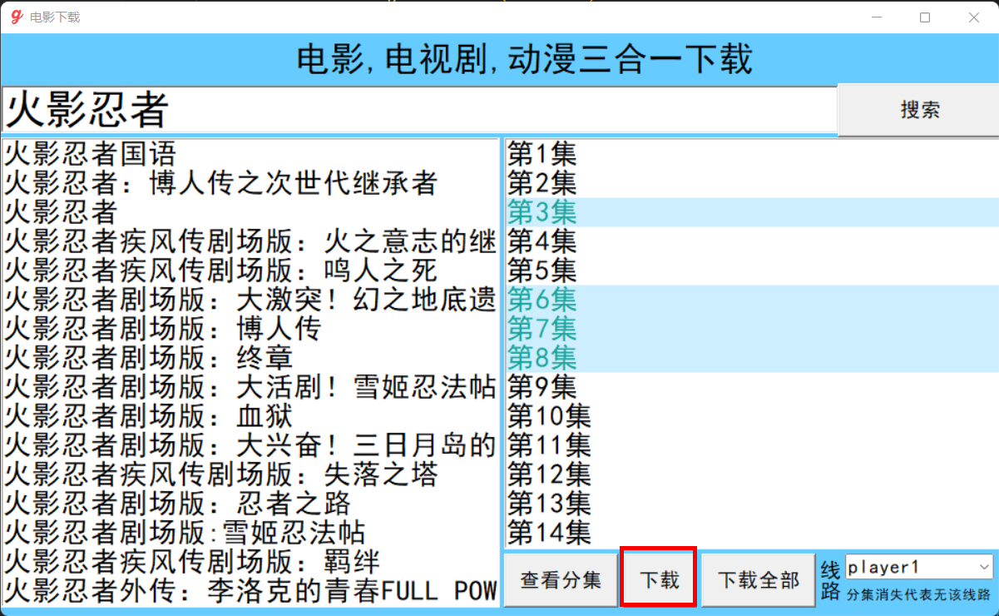
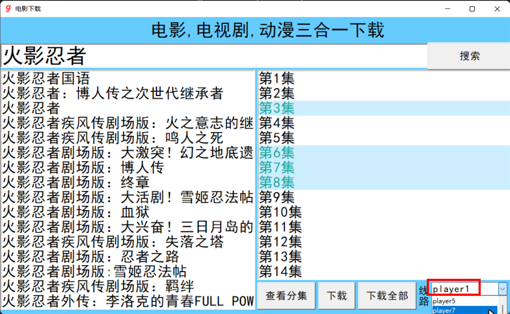

# 电影,电视剧,动漫三合一下载器使用指南

### 一、使用教程

​		双击 *三合一下载器.exe* 即可运行程序，在搜索栏中可以对电影，电视剧，动漫资源进行搜索。

​		单击选择出现的电影/电视剧/动漫，点击查看分集，查看可用的集数。

​			选择你想要下载的集数，点击下载即可开始下载，点击下载全部，自动下载所有可见集数。**(按住Ctrl或shift可多选,方法与文件资源管理器中文件多选的方法相同)**

​		点击线路旁边的下拉框，选择视频源 *(默认为线路一)* ，选择线路后会刷新剧集，若集数选择区域变为空，代表无此线路或线路目前不可用。

​		下载得到的文件会在程序同目录内 **Downloads** 文件夹内，命名方法为: *剧集名称_n.mp4* (n为集数)

### 二、常见问题 Q&A

**Q:软件使用卡顿怎么办？**

A:软件卡顿时程序正在向网页请求信息，卡顿的严重程度很大程度上取决于您的网速。如果实在无法正常使用，建议更换网络环境。(也有可能是资源更换了URL，这样你就只能自己去改程序里的URL了)

**Q:文件下载后名称乱码怎么办？**

A:您的电脑默认汉语编码方式若是`utf-8`则可能会出现此错误，您可以选择改源码或将中文编码改回默认的GBK

**Q:下载到中段后停止不下载了怎么办？**

A:您可能是选中了cmd窗口，再次选中黑色的cmd窗口然后按下回车即可

**Q:什么时候下载完毕？**

A:当cmd中指令运行完成则下载完成

**Q:文件播放过程中存在跳跃/无法播放怎么办？**

A:大概率是视频源的问题，可以尝试更换线路再下载

### 三、后记

​		本软件的所有资源均从 **[Gimy TV 剧迷影视](https://gmtv3.xyz/)** 网站爬取，非常感谢(如果你无法访问这个链接，那么大概率就用不了这个软件了)

​		软件源码不大，只有4,799 字节，m3u8文件下载借助了 [M3U8DL](https://github.com/nilaoda/N_m3u8DL-CLI) 感谢[nilaoda](https://github.com/nilaoda)大佬的开源资料。其他部分没什么好看的，就当是一个东拼西凑垃圾实用项目罢了。

​		打包成EXE的代码从右侧release获取。

|   SFKgroup |
| ---------: |
| 2022.11.05 |

